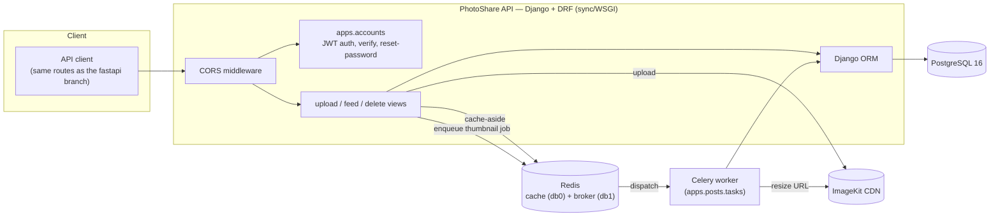

# PhotoShare (Django)


A Django + Django REST Framework port of PhotoShare's backend: JWT authentication, a photo/video feed with
Redis caching, and Celery-backed thumbnail generation. The original async FastAPI implementation is preserved
on the [`fastapi`](../../tree/fastapi) branch — this is a from-scratch rewrite of the same feature set on a
different stack, not a migration of the code itself.

Users register, log in, upload images or videos with a caption, and browse a shared feed. Each post is tied
to its owner — only the uploader can delete it. This port is API-only (no bundled frontend); the FastAPI
branch's vanilla-JS frontend talks to either backend unmodified, since both expose the same routes.

---

## Architecture



---

## Tech Stack

**Backend**
- Django 5 + Django REST Framework (sync/WSGI — no async runtime to manage)
- PostgreSQL 16, via `psycopg[binary]` (v3) and Django's own migration system
- A hand-rolled JWT layer (`apps.accounts.tokens`/`authentication.py`) — the FastAPI port's fastapi-users
  JWTStrategy is a single stateless bearer token with no refresh concept, which doesn't map cleanly onto
  SimpleJWT's access/refresh-pair design, so this reimplements that exact shape directly on PyJWT instead
  of fighting a library built around a different model
- Redis — cache-aside on `/feed` and `/posts/{id}`, same key/version scheme as the FastAPI port
- Celery — background thumbnail generation, sharing the same Django ORM the web process uses (no second
  engine needed, unlike the FastAPI port's separate sync SQLAlchemy engine for the worker)
- ImageKit (`imagekitio`) — media storage/CDN
- pytest + pytest-django — tests against a real Postgres database

**Ops**
- Docker (multi-stage) + docker-compose (postgres/redis/api/worker, all healthchecked)
- GitHub Actions CI — migrations, pytest, ruff on every push/PR
- Railway deployment (Dockerfile-based, `/health` backs the platform healthcheck)

---

## Key engineering decisions

**Sync all the way — no async runtime to reason about.** The FastAPI port's biggest source of incidental
complexity was async: a separate sync SQLAlchemy engine for the Celery worker, a nested-event-loop bug in
Alembic's env.py, a Windows-specific psycopg-async/ProactorEventLoop incompatibility, a module-level Redis
client that broke across pytest-asyncio's per-test event loops. None of that exists here — Django views,
the ORM, and Celery tasks are all plain sync code, so gunicorn's process/thread model handles concurrency
instead of an event loop, and there's exactly one way to open a database connection anywhere in the app.

**A hand-rolled JWT layer instead of SimpleJWT's default shape.** SimpleJWT is built around an
access/refresh token pair with a blacklist for revocation (see `inventra-django`, where that fits well).
PhotoShare's auth contract is different: one stateless bearer token, `POST /auth/jwt/login` accepting
form-encoded `username`/`password` fields, `400` (not `401`) on bad credentials, plus verify/reset token
flows scoped by an `aud` claim. Reimplementing this directly on PyJWT (`apps/accounts/tokens.py`) matched
the actual contract exactly instead of bending SimpleJWT's views to fit it.

**Verify/reset tokens bind to a password-hash fingerprint.** Both token kinds embed the last 16 characters
of the user's current hashed password. The moment the password actually changes, any outstanding token for
that user is instantly worthless — not just single-use by convention, but cryptographically tied to a
password that no longer exists. The FastAPI port's fastapi-users library does the same thing internally;
this makes it explicit.

**No hardcoded secrets.** `DJANGO_SECRET_KEY`, `JWT_SECRET`, and `DATABASE_URL` are all required environment
variables with no fallback — the app won't boot without them, same principle as the FastAPI port's
pydantic-settings config (and the original hardcoded JWT secret that config replaced).

**Ownership is structural, not just checked.** `DELETE /posts/{post_id}` loads the post, compares
`post.user_id` against the authenticated user, and `403`s on mismatch before any deletion happens - same
guarantee as the FastAPI port, same reasoning: verify ownership against the row you're about to touch, not
against what the caller claims.

**`<str:post_id>`, not `<uuid:post_id>`.** Django's `uuid` path converter would simply fail to match an
invalid ID and fall through to a generic 404 - but the contract here is a clean `400 Invalid post id`,
matching the FastAPI port's manual `uuid.UUID(post_id)` parsing. The path takes a plain string and the view
validates it explicitly, so an invalid ID reaches application code instead of the URL resolver.

---

## Quickstart

```bash
cp .env.example .env   # fill in real ImageKit keys, or leave placeholders if you're not testing upload
docker compose up --build
```

Reaches **http://localhost:8000**:
- `/health` — liveness + DB connectivity check
- `/admin/` — Django admin (create a superuser first: `docker compose exec api python manage.py createsuperuser`)

Migrations and `collectstatic` run automatically on container start (see `docker-entrypoint.sh`), before
gunicorn boots. The `worker` service runs the Celery worker against the same database and Redis instance.

**Running on the host instead of Docker:**

```bash
uv sync
cp .env.example .env
uv run python manage.py migrate
uv run python manage.py runserver
# in a second terminal, for background thumbnail generation:
uv run celery -A config worker --loglevel=info
```

---

## Running the tests

```bash
uv sync
cp .env.example .env   # DATABASE_URL and REDIS_URL just need to point at reachable instances
uv run pytest -v
```

pytest-django creates its own test database, runs every migration against it, and drops it when the session
ends - each test runs inside a transaction that's rolled back afterward, the same isolation goal as the
FastAPI port's SAVEPOINT-based fixture, via the mechanism pytest-django ships with instead of hand-rolled
SQLAlchemy transaction nesting. Upload tests seed `Post` rows directly via the ORM rather than calling the
real ImageKit API.

Covers: the auth lifecycle (registration, login, email verification, password reset), ownership-based
authorization (a non-owner gets `403` on delete, an owner gets `200`), and cache-aside behavior on `/feed`
and `/posts/{id}` (a second read is served from Redis, a write invalidates it) - 20 tests, functionally
equivalent to the FastAPI port's suite.

---

## Deployment

Containerized, deploys to [Railway](https://railway.app) from the Dockerfile directly (see `railway.json`).
Every required environment variable is documented in [.env.example](.env.example). Short version: create a
Railway project from this repo, add Postgres and Redis addons, set `DATABASE_URL`, `REDIS_URL`,
`DJANGO_SECRET_KEY`, `JWT_SECRET`, `ALLOWED_HOSTS`, and the three `IMAGEKIT_*` variables on the api service
(and a second service running `celery -A config worker` against the same env), deploy - migrations run
automatically before the app starts. `/health` reports app + database status and backs Railway's own
healthcheck.

---

## Project Structure

```
photoshare-api/  (main branch — Django; see the fastapi branch for the original)
├── apps/
│   ├── accounts/
│   │   ├── models.py          # User (UUID pk, email as USERNAME_FIELD, is_active/is_verified)
│   │   ├── tokens.py          # JWT encode/decode for access/verify/reset tokens
│   │   ├── authentication.py  # DRF authentication class reading those access tokens
│   │   ├── services.py        # request_verify/verify_token/forgot_password/reset_password
│   │   ├── serializers.py, views.py, urls.py
│   │   └── admin.py
│   └── posts/
│       ├── models.py          # Post (UUID pk, FK to User, thumbnail_url nullable)
│       ├── cache.py           # cache-aside helpers (feed version counter, post-detail key)
│       ├── images.py          # ImageKit client configuration
│       ├── tasks.py           # generate_thumbnail_task (Celery)
│       ├── serializers.py, views.py, urls.py
│       └── admin.py
├── config/
│   ├── settings/{base,development,production}.py
│   ├── celery.py, urls.py, wsgi.py
├── tests/                     # pytest-django suite (see "Running the tests" above)
├── manage.py
├── Dockerfile, docker-compose.yml, railway.json
└── .github/workflows/ci.yml
```

---

## API Endpoints

| Method | Path | Description |
|--------|------|--------------|
| POST | `/auth/register` | Create a new account |
| POST | `/auth/jwt/login` | Log in (form-encoded `username`/`password`), returns a JWT access token |
| POST | `/auth/jwt/logout` | No-op confirmation (the token is stateless; nothing to revoke) |
| POST | `/auth/request-verify-token` | Request an email verification token |
| POST | `/auth/verify` | Verify an account with a token |
| POST | `/auth/forgot-password` | Request a password reset token |
| POST | `/auth/reset-password` | Reset password with a token |
| GET | `/users/me` | Get the current authenticated user |
| PATCH | `/users/me` | Update the current user |
| GET | `/users/{id}` | Get a user by ID (admin only) |
| DELETE | `/users/{id}` | Delete a user (admin only) |
| POST | `/upload` | Upload an image/video with a caption (auth required) |
| GET | `/feed` | Paginated feed, newest first, with per-post ownership flags (auth required) |
| GET | `/posts/{post_id}` | Post detail, with an ownership flag (auth required) |
| DELETE | `/posts/{post_id}` | Delete a post you own (`403` otherwise) |
| GET | `/health` | App + database status |

---

## Data Model

```
User (1) ──< Post (many)
```

- `User` — id (UUID), email, hashed password, is_active/is_verified flags
- `Post` — id (UUID), user (FK, indexed), caption, url, thumbnail_url (nullable), file_type, file_name,
  created_at (indexed)

---

## FastAPI vs. Django: what actually changed

The `fastapi` branch and this one implement the identical contract - same routes, same request/response
shapes, same test suite in spirit (20 tests either way). What's genuinely different:

- **Async vanished as a concern, not just a library choice.** The FastAPI port's real bugs during
  development were disproportionately async-related (see "Sync all the way" above). None of those bug
  classes exist in the Django port - not because Django is more careful, but because there's no async
  runtime for those bugs to live in. The tradeoff is real, though: Django/gunicorn's concurrency is
  process/thread-based, which has a lower ceiling on I/O-bound concurrent connections per instance than an
  event loop does. For a photo-sharing feed with bursty-but-moderate traffic, that ceiling isn't the
  bottleneck; for something like a chat server holding thousands of concurrent long-lived connections, it
  would be.
- **The ORM is the same tool everywhere.** SQLAlchemy async in the request path, plain sync SQLAlchemy in
  the Celery worker - two engines, two mental models, one database. Django's ORM is sync-only, so it's the
  *same* one everywhere, at the cost of not being async at all.
- **Auth needed hand-rolled code instead of a library fit.** fastapi-users' JWTStrategy is a stateless
  single-token design; SimpleJWT is an access/refresh-pair design. Neither FastAPI nor Django "won" here -
  the FastAPI port got its auth contract for free from a library that happened to match; the Django port
  had to write `apps/accounts/tokens.py` by hand because the natural DRF library didn't match the same
  contract. That's a library-fit accident, not a framework capability gap.
- **The admin is the single biggest capability gap in the other direction.** Django ships a working,
  ACL-aware admin UI (`/admin/`) for free from the models already defined for the API - inspecting/editing
  any User or Post without writing a single line of UI code. The FastAPI port has no equivalent; building
  one would mean either a separate admin app or hand-rolling authenticated CRUD screens.
- **Ecosystem maturity shows up as fewer decisions, not more code.** `django-cors-headers`, `whitenoise`,
  `dj-database-url`, Django's built-in password validators - all boring, all "the" way to do that thing in
  Django, versus picking and wiring equivalents for FastAPI (which is more flexible, but every equivalent
  is a decision).

**When I'd choose which:** Django/DRF for anything CRUD-and-admin-heavy where a working back-office UI is
worth more than raw async throughput - which is most internal tools and most content-management-shaped
products. FastAPI for anything where async concurrency is load-bearing (webhooks fanning out to slow
downstreams, long-lived connections, high-fan-out I/O-bound workloads) or where the team already lives in
the async Python ecosystem. PhotoShare itself is arguably a toss-up either way at this scale - which is
exactly why it's a useful project to have built twice.

---

## Author

Tharun Sridhar
