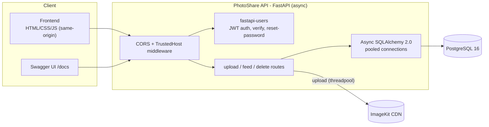

# PhotoShare


A photo/video sharing backend: JWT authentication, async SQLAlchemy relational modeling, third-party media storage via ImageKit, and a same-origin vanilla JS frontend.

- Users register, log in, upload images or videos with a caption, and browse a shared feed.
- Each post is tied to its owner. Only the uploader can delete it.

🔗 **Live demo:** _not deployed yet, see [Deployment](#deployment) for the Railway steps, then replace this line with the live URL_
📘 **API docs:** `<your-domain>/docs` (Swagger UI, generated from the code below)

---

## Screenshots

<table>
<tr>
<td></td>
<td></td>
</tr>
<tr>
<td></td>
<td></td>
</tr>
</table>

---

## Architecture



---

## Tech Stack

**Backend**
- FastAPI (async)
- SQLAlchemy 2.0 (async) + psycopg v3, PostgreSQL 16
- Alembic for versioned migrations
- fastapi-users for JWT auth, registration, email verification, password reset
- pydantic-settings, every config value from the environment, no hardcoded secrets
- ImageKit (`imagekitio`) for media storage/CDN
- pytest + pytest-asyncio + httpx, tests against a real Postgres database

**Frontend**
- Vanilla HTML / CSS / JavaScript (no framework, no build step)
- Served directly by FastAPI via `StaticFiles`, same origin as the API

**Ops**
- Docker (multi-stage) + docker-compose (Postgres, healthchecked)
- GitHub Actions CI: migrations, pytest, ruff on every push/PR
- Railway deployment (Dockerfile-based, `/health` backs the platform healthcheck)

---

## Key engineering decisions

**Async all the way, except where it can't be.**
- SQLAlchemy's async engine, fastapi-users' async adapters, async route handlers throughout.
- The one exception is `/upload`: writing the file to disk and calling ImageKit's (synchronous) upload API are both blocking calls, so they run via `run_in_threadpool` instead of directly in the event loop. Otherwise every upload would stall every other concurrent request for its full duration.

**No hardcoded secrets.**
- The JWT/verification/password-reset secret used to be a literal string committed to the repo (`SECRET = "ILVUQBJED"`).
- It's now `pydantic-settings` reading `JWT_SECRET` from the environment with no fallback, the app won't boot without it.
- Note for the record: the old hardcoded value is still visible in this repo's git history from before this migration. Treat it as permanently compromised, not just replaced.

**Ownership is structural, not just checked.**
- `DELETE /posts/{id}` loads the post, compares `post.user_id` against the authenticated user, and 403s on mismatch before any deletion happens.
- It's a small surface (one mutation route), so the check lives in one place rather than needing a shared authorization layer, but the principle is the same one Inventra uses at larger scale: verify ownership against the row you're about to touch, not against what the caller claims.

**Migrations instead of `create_all()`.**
- This app used to call `Base.metadata.create_all()` on every startup, fine for a throwaway SQLite file, no upgrade path for a real database.
- Alembic's initial migration was generated against the actual installed `fastapi-users` schema (not hand-typed), specifically to avoid guessing at a third-party library's column types.

**Retrying, not silencing, a flaky test-database connection.**
- CI's `postgres:16-alpine` service container occasionally rejects a connection made shortly after startup with a spurious "password authentication failed".
- Confirmed via the container's own logs that it matches the correct `pg_hba.conf` rule and still rejects a password that an otherwise-identical connection accepts moments later, so it's a transient startup race, not a real credentials bug.
- It showed up on two different connections in [`tests/conftest.py`](tests/conftest.py): the admin engine's `DROP`/`CREATE DATABASE`, and Alembic's own internal engine during migration. Both are wrapped in a bounded retry rather than papering over just the one that happened to fail first.

**Same-origin frontend, not "CORS elimination."**
- The frontend is served same-origin via FastAPI's `StaticFiles`, so the demo's own UI never triggers a CORS preflight.
- Worth stating precisely: this doesn't eliminate CORS as a concern. The `CORS + TrustedHost middleware` in the architecture diagram is still there and still required for any other client (a separate frontend deployment, a mobile app, `/docs` hitting the API from a different origin) to call this API at all.
- What same-origin serving actually buys is avoiding an entire class of cross-origin config/misconfiguration risk *for this specific deployment shape*, not a reduction in CORS overhead generally.

---

## Quickstart

```bash
cp .env.example .env   # fill in real ImageKit keys, or leave placeholders if you're not testing upload
docker compose up --build
```

Reaches **http://localhost:8000**:
- `/`: the frontend (login screen and app)
- `/docs`: interactive Swagger UI
- `/health`: liveness + DB connectivity check

Migrations run automatically on container start (see `docker-entrypoint.sh`), before `uvicorn` boots.

**Running on the host instead of Docker:**

```bash
uv sync
cp .env.example .env
uv run alembic upgrade head
uv run main.py
```

---

## Running the tests

```bash
uv sync
cp .env.example .env   # DATABASE_URL just needs to point at a reachable Postgres 16
uv run pytest -v
```

- The suite creates its own `<database>_pytest` database, runs every Alembic migration against it, and drops it when the session ends.
- Each test runs inside a transaction that's rolled back afterward.
- Upload tests seed `Post` rows directly via the ORM rather than calling the real ImageKit API, not something to depend on in CI.

Covers the auth lifecycle (registration, login, email verification, password reset; tokens are captured the way an email template would, since there's no mail service wired up) and ownership-based authorization (a non-owner gets `403` on delete, an owner gets `200`).

---

## Deployment

- Containerized, deploys to [Railway](https://railway.app) from the Dockerfile directly (see `railway.json`).
- Every required environment variable is documented in [.env.example](.env.example).
- Short version: create a Railway project from this repo, add a PostgreSQL addon, set `DATABASE_URL=${{Postgres.DATABASE_URL}}`, `JWT_SECRET`, and the three `IMAGEKIT_*` variables on the api service, deploy. Migrations run automatically before the app starts.
- `/health` reports app + database status and backs Railway's own healthcheck.

---

## Project Structure

```
photoshare-api/
├── app/
│   ├── app.py       # FastAPI app instance, middleware, /health, routes (upload, feed, delete)
│   ├── config.py    # pydantic-settings; every value documented in .env.example
│   ├── db.py        # SQLAlchemy models (User, Post) + async engine/session
│   ├── users.py     # fastapi-users setup: JWT backend, UserManager
│   ├── schemas.py   # Pydantic request/response schemas
│   └── images.py    # ImageKit client configuration
├── alembic/         # migrations (single clean initial revision, generated against the real fastapi-users schema)
├── static/          # index.html, style.css, script.js
├── tests/           # pytest suite (see "Running the tests" above)
├── main.py          # entrypoint, runs uvicorn
├── Dockerfile, docker-compose.yml, railway.json
└── .github/workflows/ci.yml
```

---

## API Endpoints

| Method | Path | Description |
|--------|------|--------------|
| POST | `/auth/register` | Create a new account |
| POST | `/auth/jwt/login` | Log in, returns a JWT access token |
| POST | `/auth/jwt/logout` | Invalidate the current token |
| POST | `/auth/forgot-password` | Request a password reset token |
| POST | `/auth/reset-password` | Reset password with a token |
| POST | `/auth/request-verify-token` | Request an email verification token |
| POST | `/auth/verify` | Verify an account with a token |
| GET | `/users/me` | Get the current authenticated user |
| PATCH | `/users/me` | Update the current user |
| GET | `/users/{id}` | Get a user by ID |
| DELETE | `/users/{id}` | Delete a user |
| POST | `/upload` | Upload an image/video with a caption (auth required) |
| GET | `/feed` | Paginated feed, newest first, with per-post ownership flags (auth required) |
| DELETE | `/posts/{post_id}` | Delete a post you own (`403` otherwise) |
| GET | `/health` | App + database status |

Full interactive documentation is available at `/docs` once the server is running.

---

## Data Model

```
User (1) --< Post (many)
```

- `User`: id, email, hashed password, active/verified flags (managed by fastapi-users)
- `Post`: id, user_id (FK, indexed), caption, url, file_type, file_name, created_at (timezone-aware, indexed)

---

## Author

Tharun Sridhar
