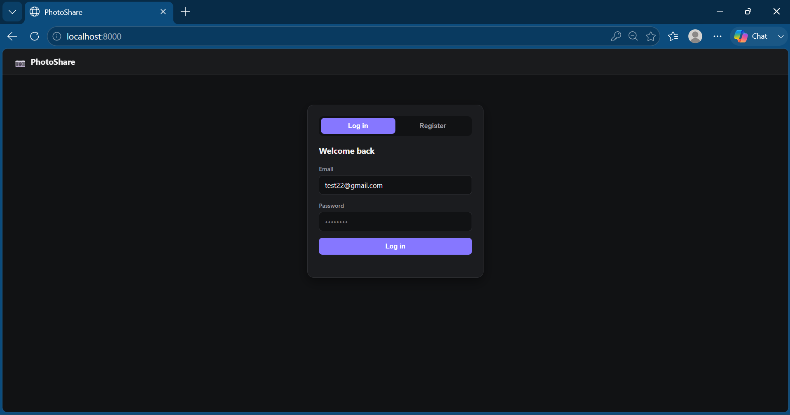
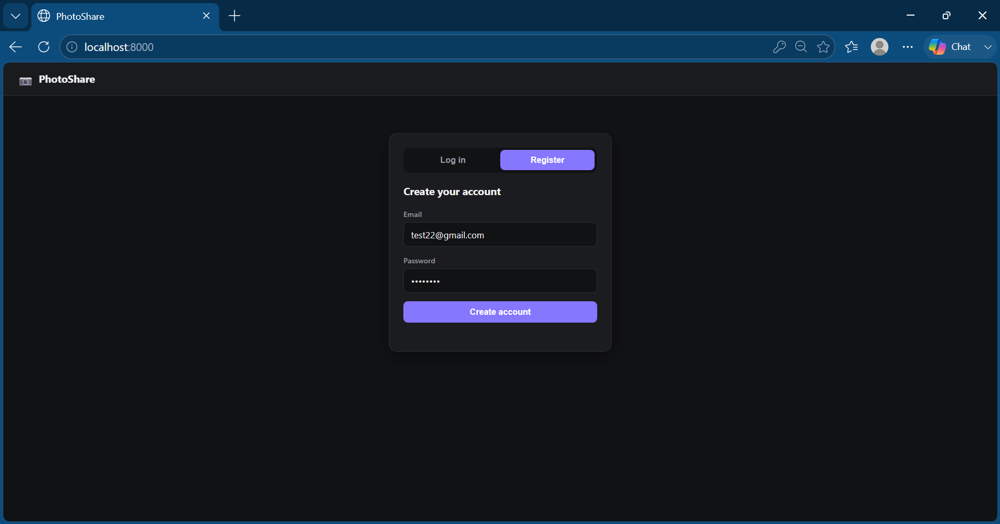
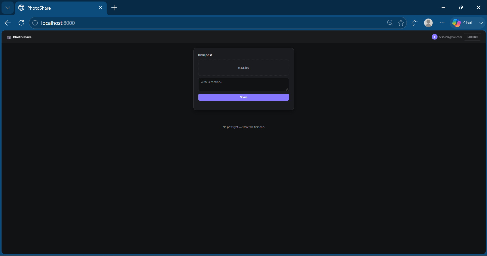
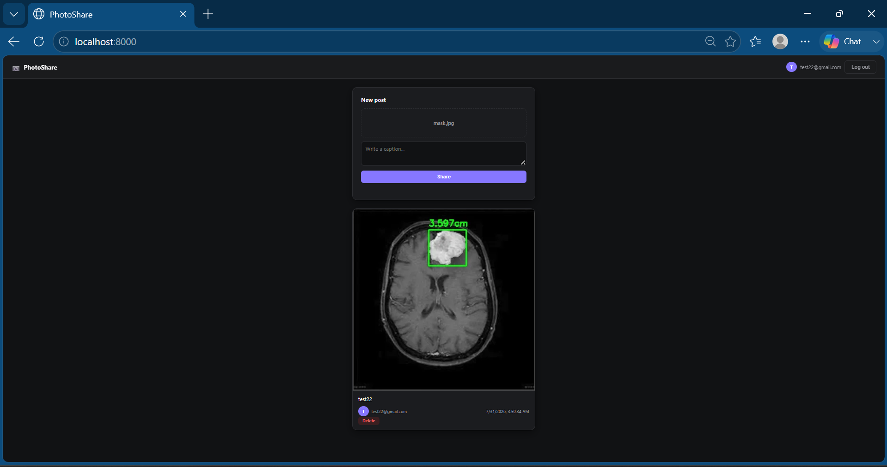

# PhotoShare API


A photo/video sharing backend built with FastAPI — JWT authentication, async SQLAlchemy relational modeling, third-party media storage via ImageKit, and a same-origin vanilla JS frontend.

Users register, log in, upload images or videos with a caption, and browse a shared feed. Each post is tied to its owner — only the uploader can delete it.

---

## Screenshots

<table>
<tr>
<td></td>
<td></td>
</tr>
<tr>
<td></td>
<td></td>
</tr>
</table>

---

## Features

- Email/password authentication with JWT (register, login, logout)
- Email verification and forgot/reset-password flows
- Image and video upload, stored via the ImageKit API
- Shared feed of all posts, newest first, with per-post ownership flags
- Owners can delete their own posts; everyone else gets a `403`
- Single FastAPI process serves both the REST API and the frontend — no separate server, no CORS

---

## Tech Stack

**Backend**
- FastAPI
- SQLAlchemy (async) + aiosqlite
- fastapi-users — JWT auth, user management
- ImageKit (`imagekitio`) — media storage/CDN
- uvicorn

**Frontend**
- Vanilla HTML / CSS / JavaScript (no framework, no build step)
- Served directly by FastAPI via `StaticFiles`

**Tooling**
- [uv](https://github.com/astral-sh/uv) for dependency management

---

## Project Structure

```
new-project/
├── app/
│   ├── app.py       # FastAPI app instance, routes (upload, feed, delete)
│   ├── db.py         # SQLAlchemy models (User, Post) + async engine/session
│   ├── users.py       # fastapi-users setup: JWT backend, UserManager
│   ├── schemas.py     # Pydantic request/response schemas
│   └── images.py      # ImageKit client configuration
├── static/
│   ├── index.html
│   ├── style.css
│   └── script.js
├── main.py            # Entrypoint — runs uvicorn
├── pyproject.toml
└── uv.lock
```

---

## Setup

Requires Python 3.14+ and [uv](https://github.com/astral-sh/uv).

```bash
uv sync
```

Create a `.env` file in the project root (see `.env.example`):

```
IMAGEKIT_PRIVATE_KEY=your_private_key
IMAGEKIT_PUBLIC_KEY=your_public_key
IMAGEKIT_URL=https://ik.imagekit.io/your_id
```

Get these from your [ImageKit dashboard](https://imagekit.io/dashboard).

## Run

```bash
uv run main.py
```

Open `http://localhost:8000` for the app, or `http://localhost:8000/docs` for interactive API docs.

---

## API Endpoints

| Method | Path | Description |
|--------|------|--------------|
| POST | `/auth/register` | Create a new account |
| POST | `/auth/jwt/login` | Log in, returns a JWT access token |
| POST | `/auth/jwt/logout` | Invalidate the current token |
| POST | `/auth/forgot-password` | Request a password reset token |
| POST | `/auth/reset-password` | Reset password with a token |
| POST | `/auth/request-verify-token` | Request an email verification token |
| POST | `/auth/verify` | Verify an account with a token |
| GET | `/users/me` | Get the current authenticated user |
| PATCH | `/users/me` | Update the current user |
| GET | `/users/{id}` | Get a user by ID |
| DELETE | `/users/{id}` | Delete a user |
| POST | `/upload` | Upload an image/video with a caption (auth required) |
| GET | `/feed` | List all posts, newest first (auth required) |
| DELETE | `/posts/{post_id}` | Delete a post you own |

Full interactive documentation is available at `/docs` once the server is running.

---

## Data Model

```
User (1) ──< Post (many)
```

- `User` — id, email, hashed password, active/verified flags (managed by fastapi-users)
- `Post` — id, user_id (FK), caption, url, file_type, file_name, created_at

---

## Author

Tharun Sridhar
